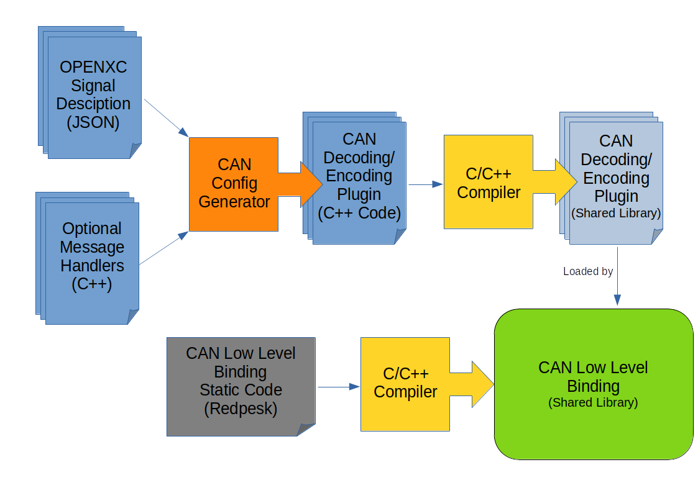

# redpesk@ CAN binding architecture

Meant to:

* Generate CAN decoding/encoding shared libraries.
* Load them.
* Decode/Encode any CAN message.

Bringing CAN management into the redpesk@ project is more than allowing
decoding and printing CAN messages, lot of tools can do that (Wireshark,
CAN-utils, ...).

The goal is to provide a common API and abstraction to the CAN bus so you can
bring some more high level functionalities to the system.

CAN binding will be separated in two parts:

* High level: Binding from which others applications will connect to.
It will provide valuable access to the CAN bus by aggregating signals or
providing new signals from several sources. For example, a signal exposing
whether or not a door is open, no matter which one it is. Also, we can imagine
an application which supervises if there is no one in the car but moving
(1m, 2m ?) to alert the owner of an unexpected behavior. The high level binding
will send a single event representing that behavior to the application which in
turn will send a phone message to.

* Low level: Decode messages that transit and send events through **Application Framework** to the subscribers with human readable messages. It provides some basic access to the bus + some basic mathematical, statistical features (last_values, min, max, timestamps, averaging) as well as basic filters to get discerning signals only.

Last but not least, the low level binding can be shipped as binary only using OpenXC inspired [redpesk@ canbus Generator](https://github.com/redpesk-common/canbus-generator).
