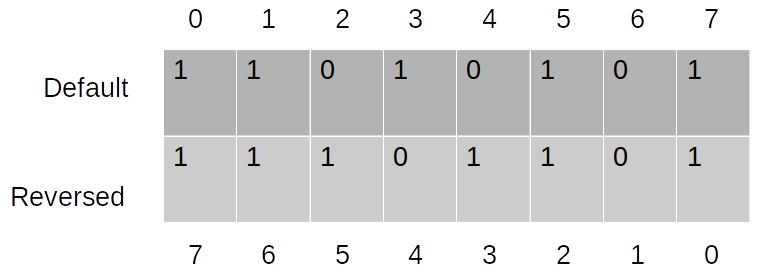

# Prerequisites

The low-level-can-generator generates c++ plugins from json mapping files
for the rp-can-low-level binding.

## Install the can-low-level devel version

If you have installed the rp-can-low-level from sources you already have the
devel version installed.

Else install the "rp-can-low-level-devel" package using your package manager.

## Install the generator <p>

To generate your plugins you will need the low-level-can-generator.

```bash
dnf install rp-low-level-can-generator
```

or from the sources:

```bash 
git clone https://github.com/redpesk-common/low-level-can-generator
cd low-level-can-generator
mkdir build
cd build
cmake ..
make
sudo make install
```

# Install the redpesk plugins

# Write your json mapping file <p>

In this json file will be defined all the messages you will recieve from your
connected device.

The generator uses OpenXC.[Here is the original documentation.](https://github.com/openxc/vi-firmware/blob/master/docs/config/reference.rst)

You can find a plugin template by installing the 
"rp-can-low-level-plugin-template" package. This package contains a json 
mapping file, a simple plugin header file and a CMake file for easy build.

## General Options <p>

* *`name`* <p> Set plugin's name. It will be your plugin's id in the binding.
It has to be unique.

* *`version`* <p>Set plugin's version. It will define which version of the
decoders will be used. Available versions are v1 and v2, the latest being v2.

* *`extra_sources`* <p> Set sources to be added to the top of the generated
plugin. It can be your own c++ signal decoders for example.

## Message<p>

The *`messages`* key is a object with fields mapping from CAN message IDs 
to signal definitions. The fields must be hex IDs of CAN messages
as strings (e.g. 0x90).

* *`name`* <p> The name of the CAN message. Can be used to easily find a 
certain message among the others.

* *`bus`* <p> The name of the CAN bus where the messages can be found.

* *`comment`* <p> To give a piece of information about the message. Useful 
when reading the code.

* *`length`* <p> Message's length in bytes.

* *`is_fd`* <p> Either True or False. Determines if your device uses CAN FD
or not.

* *`is_extended`* <p> Either True or False. Determines if the CAN ID is 11 bits
or 29 bits long.

* *`is_j1939`* <p> Either True or False. Determines if you devices uses the
j1939 protocol.

* *`byte_frame_is_big_endian`* <p> Either True or False. Determines if the
whole frame will be read as a big endian or not.

* *`bit_position_reversed`* <p> Either True or False. Determines if index 0 of a byte starts at 0 or 0+size-1.


* *`signals`* <p> A list of CAN signal objects (described in the 
[signal](#signal) section) that are in this message, with the name of the
signal as the key.

* *`max_frequency`* <p>
If sending raw CAN messages to the output interfaces, this controls the maximum
frequency (in Hz) that the message will be process and let through. The default
value (0) means that all messages will be processed, and there is no limit
imposed by the firmware. If you want to make sure you don't miss a change in
value even when rate limiting, see the force_send_changed attribute. Defaults
to 0 (no limit).

* *`max_signal_frequency`* <p>
Setting the max signal frequency at the message level will cascade down to all
of the signals within the message (unless overridden). The default value (0)
means that all signals will be processed, and there is no limit imposed by the
firmware. See the max_frequency flag documentation for the signal mapping for
more information. If you want to make sure you don't miss a change in value
even when rate limiting, see the force_send_changed_signals attribute. Defaults
to 0 (no limit).

* *`force_send_changed`* <p>
Meant to be used in conjunction with max_frequency, if this is true a raw CAN
message will be sent regardless of the given frequency if the value has changed
(when using raw CAN passthrough). Defaults to true.

* *`force_send_changed_signals`* <p>
Setting this value on a message will cascade down to all of the signals within
the message (unless overridden). See the force_send_changed flag documentation
for the signal mapping for more information. Defaults to false.

## Signal <a name="#signal"></a> <p>

The attributes of a signal object within a message are:

* *`generic_name`* <p>
The name of the associated generic signal name (from the OpenXC specification)
that this should be translated to. Optional - if not specified, the signal is
read and stored in memory, but not sent to the output bus. This is handy for
combining the value of multiple signals into a composite measurement such as
steering wheel angle with its sign.

* *`bit_position`* <p>
The starting bit position of this signal within the message.

* *`bit_size`* <p>
The width in bits of the signal.

* *`factor (optional)`* <p>
The signal value is multiplied by this if set.

* *`offset (optional)`* <p>
This is added to the signal value if set.

* *`min_value (optional)`* <p>
The minimum value for the processed signal.

* *`max_value (optional)`* <p>
The maximum value for the processed signal.

* *`send_same (optional)`* <p>
If true, will re-send even if the value hasn't changed.

* *`force_send_changed (optional)`* <p>
If true, regardless of the frequency, it will send the value if it has changed.

* *`sign (optional)`* <p>
If the data is signed it indicates the encode.

* *`bit_sign_position (optional)`* <p>
The bit that indicates the sign of the signal in its CAN message.

* *`unit (optional)`* <p>
The unit of the data.

* *`decoder (optional)`* <p>
The name of a function that will be compiled with the firmware and should be
applied to the signal's value after the normal translation. See the
[Signal Decoder](#SignalDecoder) section for details.

* *`ignore (optional)`* <p>
Setting this to true on a signal will silence output of the signal. The VI
will not monitor the signal nor store any of its values. This is useful if
you are using a custom decoder for an entire message, want to silence the
normal output of the signals it handles. If you need to use the previously
stored values of any of the signals, you can use the ignoreDecoder as the
decoder for the signal. Defaults to false.

* *`enabled (optional)`* <p>
Enable or disable all processing of a CAN signal. By default, a signal is
enabled; if this flag is false, the signal will be left out of the generated
source code. Defaults to true.

>The difference between ignore, enabled and using an ignoreDecoder can be
confusing. To summarize the difference:
> * The enabled flag is the master control switch for a signal - when this
is false, the signal (or message, or mapping) will not be included in the
firmware at all. A common time to use this is if you want to have one
configuration file with many options, only a few of which are enabled in
any particular build.
> * The ignore flag will not exclude a signal from the firmware, but it will
not include it in the normal message processing pipeline. The most common use
case is when you need to reference the bit field information for the signal
from a custom decoder.
> * Finally, use the ignoreDecoder for your signal's decoder to both include
it in the firmware and handle it during the normal message processing pipeline,
but just silence its output. This is useful if you need to track the last known
value for this signal for a calculation in a custom decoder.

* *`states`* <p>
This is a mapping between the desired descriptive states (e.g. off) and the
corresponding numerical values from the CAN message (usually an integer). The
raw values are specified as a list to accommodate multiple raw states being
coalesced into a single final state (e.g. key off and key removed both mapping
to just "off").

* *`max_frequency (optional)`* <p>
Some CAN signals are sent at a very high frequency, likely more often than will
ever be useful to an application. This attribute sets the maximum frequency (Hz)
that the signal will be processed and let through. The default value (0) means
that all values will be processed, and there is no limit imposed by the
firmware. If you want to make sure you don't miss a change in value even when
dropping messages, see the force_send_changed attribute. You probably don't
want to combine this attribute with send_same or else you risk missing a status
change message.
Defauls to 0 (no limit).

* *`send_same (optional)`* <p>
By default, all signals are translated every time they are received from the
CAN bus. By setting this to false, you can force a signal to be sent only if
the value has actually changed. This works best with boolean and state based
signals. Defaults to true.

* *`force_send_changed (optional)`* <p>
Meant to be used in conjunction with max_frequency, if this is true a signal
will be sent regardless of the given frequency if the value has changed. This
is useful for state-based and boolean states, where the state change is the
most important thing and you don't want that message to be dropped. Defaults
to false.

* *`writable (optional)`* <p>
Set this attribute to true to allow this signal to be written back to the CAN
bus by an application. By default, the value will be interpreted as a floating
point number. Defaults to false.

* *`encoder (optional)`* <p>
You can specify a custom function here to encode the value for a CAN messages.

## Diagnostic Messages

The *`diagnostic_messages`* key is an array of objects describing a recurring diagnostic message request.

The attributes of each diagnostic message object are:

* *`bus`* <p>
The name of one of the previously defined CAN buses where this message should be requested.
* *`id`* <p>
the arbitration ID for the request.
* *`mode`* <p>
The diagnostic request mode, e.g. Mode 1 for powertrain diagnostic requests.
* *`frequency`* <p>
The frequency in Hz to request this diagnostic message. The maximum allowed frequency is 10Hz.
* *`pid (optional)`* <p>
If the mode uses PIDs, the pid to request.
* *`name (optional)`* <p>
A human readable, string name for this request. If provided, the response will have a name field (much like a normal translated message) with this value in place of bus, id, mode and pid.
* *`decoder (optional)`* <p>
When using a name, you can also specify a custom decoder function to parse the payload. This field is the name of a function (that matches the DiagnosticResponseDecoder function prototype). When a decoder is specified, the decoded value will be returned in the value field in place of payload.
* *`callback (optional)`* <p>
This field is the name of a function (that matches the DiagnosticResponseCallback function prototype) that should be called every time a response is received to this request.

## Signal Decoder <a name="#SignalDecoder"></a><p>

The default decoder for each signal is a simple passthrough, translating the
signal's value from engineering units to something more usable (using the
defined factor and offset). Some signals require additional processing that you
may wish to do within the binding and not on the host device. Other signals may need
to be combined to make a composite signal that's more meaningful to developers.

There is however a list of ready to use decoders provided by the low-can binding: 

* decode_state
* decode_booleanl
* decode_ignore
* decode_noop
* decode_bytes
* decode_ascii
* decode_date
* decode_time
* decode_signal
* decode_obd2_response

You can also define your own decoder. To do so, create a **signal-header.cpp**
file that will be added to the top of the generated c++ plugin file by adding
its filename to the *`extra_sources`* field. Then write you own decoder 
in this file. Here is an example:

```c++
openxc_DynamicField decoder_t::decode_date(signal_t& signal, std::shared_ptr<message_t> message, bool* send)
{
	float value = decoder_t::parse_signal_bitfield(signal, message);
	AFB_DEBUG("Decoded message from parse_signal_bitfield: %f", value);
	openxc_DynamicField decoded_value = build_DynamicField(value);

	// Don't send if they is no changes
	if ((signal.get_last_value() == value && !signal.get_send_same()) || !*send )
		*send = false;
	signal.set_last_value(value);

	return decoded_value;
}
```

## Json Example <p>

```json
{	"name": "NMEA2000",
	"version" : "2.0",
	"extra_sources": [],
	"messages": {
		"60160": {
			"name": "Iso.Transport.Protocol.Data.Transfer",
			"bus":"j1939",
			"comment":"ISO Transport Protocol, Data Transfer",
			"length": 8,
			"is_fd": false,
			"is_extended": false,
			"is_j1939": true,
			"byte_frame_is_big_endian": true,
			"bit_position_reversed": true,
			"signals": {
				"Sid": {
					"bit_position": 0,
					"bit_size": 8,
					"sign": 0,
					"generic_name": "Iso.Transport.Protocol.Data.Transfer.Sid"
				},
				"Data": {
					"bit_position": 8,
					"bit_size": 56,
					"decoder": "decoder_t::decode_bytes",
					"sign": 0,
					"generic_name": "Iso.Transport.Protocol.Data.Transfer.Data"
				}
			}
		},
		"60160#1": {
			"name": "60160",
			"bus":"j1939",
			"comment":"Abstract signals for 60160",
			"length": 8,
			"is_fd": false,
			"is_extended": false,
			"is_j1939": true,
			"byte_frame_is_big_endian": true,
			"bit_position_reversed": true,
			"signals": {
				"signal.60160": {
					"bit_position": 0,
					"bit_size": 64,
					"comment": "One signals",
					"decoder": "decoder_t::decode_60160",
					"sign": 0,
					"generic_name": "signal.60160"
				}
			}
		}
	}
}
```

# Generate your plugin 

To generate your plugin you'll have to use the low-level-can-generator.
Once you have installed the generator and wrote your json mapping file, execute
this command: 

 ```bash
can-config-generator -m you-mapping-file.json -o your-plugin-name.cpp
 ```

# Build and install your plugin

At the root of your plugin project (replace "generated-plugin" by the name of
your plugin).

```bash
mkdir build && cd build
cmake ..
make generated-plugin
make install_generated-plugin
```

Now activate the plugin in the can-low-level.
To do so, edit the control-rp-can-low-level.json file to
make it look like the example down below. This file should be located in
/usr/local/rp-can-low-level/etc/.
```json
{
	"$schema": "",
	"metadata": {
		"uid": "Low Can",
		"version": "2.0",
		"api": "low-can",
		"info": "Low can Configuration"
	},
	"config": {
		"active_message_set": 0,
		"dev-mapping": {
			"hs": "can0",
			"ls": "can0",
			"j1939": "can0"
		},
		"diagnostic_bus": "hs"
	},
	"plugins": [
		{
			"uid": "generated-plugin",
			"info": "custom generated plugin",
			"libs": "generated-plugin.ctlso"
		}
	]
}
```

Congratulations, your plugin is now ready to be used.